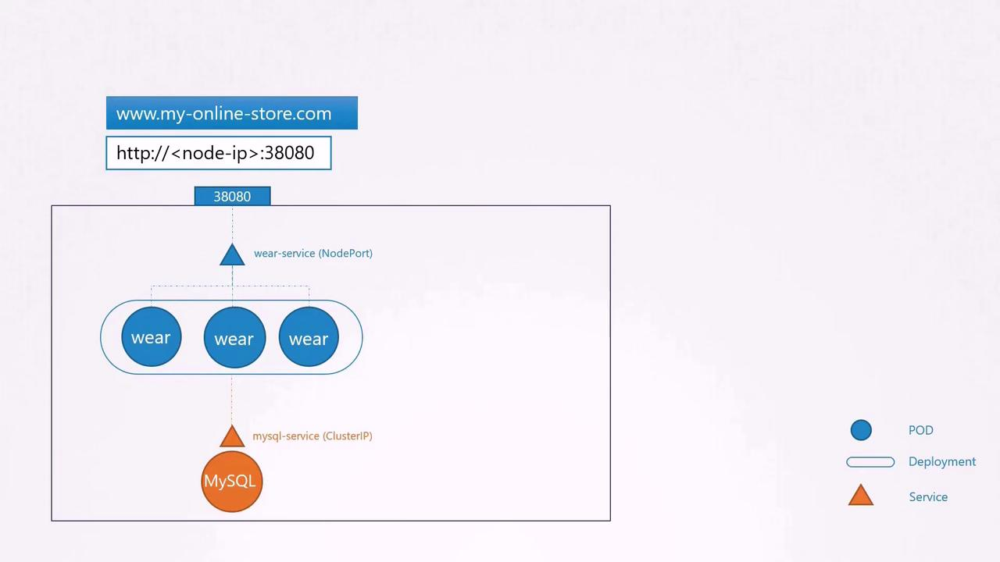
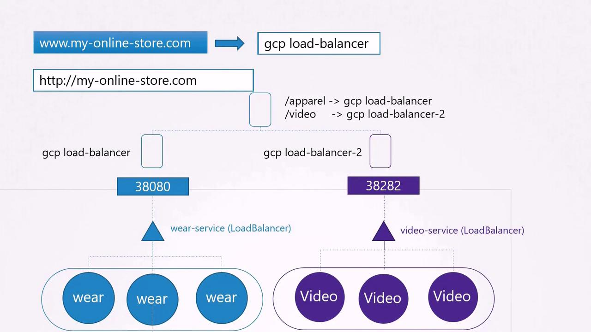
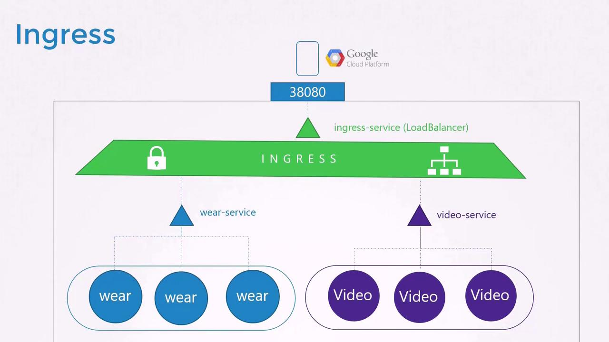
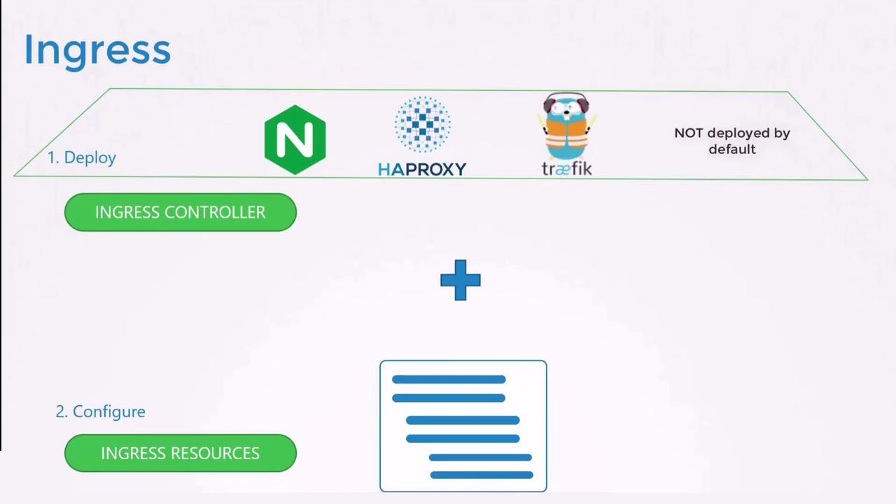
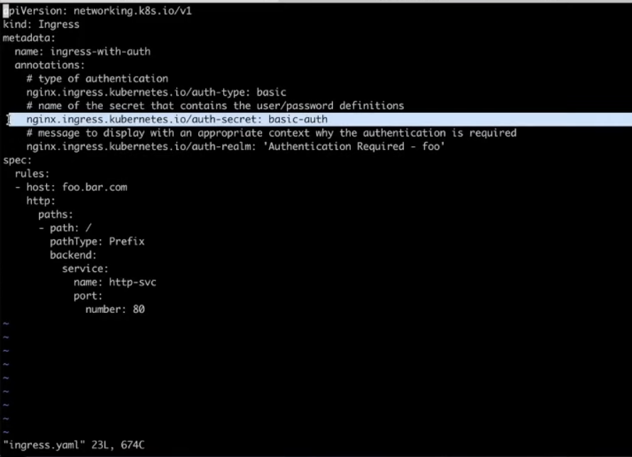
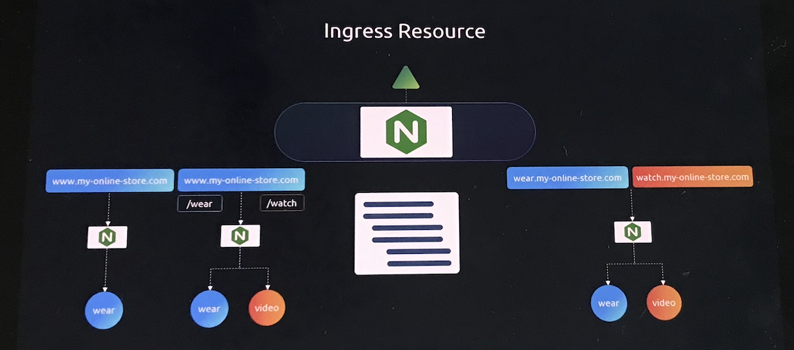
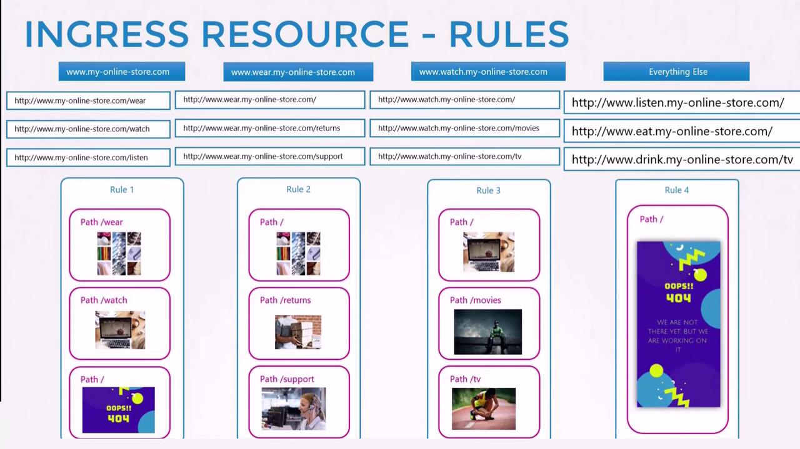
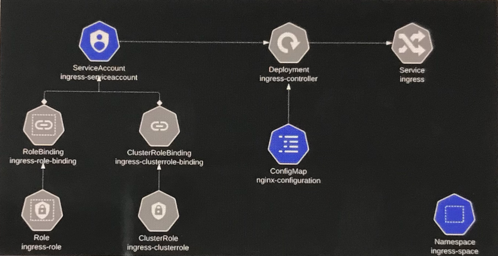

# Ingress

> 💡 This article provides a comprehensive guide on Kubernetes Ingress, covering its configuration, deployment, and use cases for managing external access to applications.

**The Evolution of Traffic Management in Kubernetes**

**Historical Context**

Before December 2015, Kubernetes lacked a native Ingress resource. Organizations migrating from legacy virtual machine (VM) or physical server environments found that standard Kubernetes Services could not match the sophisticated capabilities of enterprise load balancers like NGINX or F5. While Red Hat OpenShift addressed this early on with "Routes," Kubernetes eventually formalized the Ingress resource to satisfy user demand for advanced traffic control.

**Key Capabilities and Enterprise Features**

Ingress restores the load balancing functionalities commonly found in traditional IT environments, including:

- **Sticky Sessions:** Ensuring a specific user's requests are consistently routed to the same pod.
- **Ratio-based Balancing:** Distributing traffic based on predefined weights (e.g., 30% of traffic to Pod A, 70% to Pod B).
- **Security Controls:** Implementing whitelisting (allowing specific IPs) or blacklisting (blocking traffic from specific regions or known malicious actors).
- **TLS/SSL Offloading:** Managing secure HTTPS connections at the entry point rather than at the individual application level.

## Example: Using Services for External Access

Imagine you are deploying an application for a company with an online store at myonlinestore.com. You build your application as a Docker image and deploy it on a Kubernetes cluster as a pod within a Deployment. The application requires a database, so you deploy a MySQL pod and expose it with a ClusterIP Service named MySQL service. Internally, your application functions properly.

To expose the application externally, you create a Service of type NodePort, mapping the application to a high port (e.g., 38080) on your cluster nodes. In this configuration, users access your application using a URL like:

http\://\<node_IP>:38080



As traffic increases, you simply scale up by increasing the replica count, and the Service load-balances the requests among multiple application pods.

In a production environment, however, you likely want users to access your application through a user-friendly domain name instead of a node IP address with a high port number. To achieve this, you would update your DNS configuration to point to your node IPs and deploy a proxy server that forwards requests from standard port 80 (or 443 for HTTPS) on your DNS to the NodePort defined in your cluster. With this approach, users can simply navigate to myonlinestore.com.

**Cloud-Native Approach with LoadBalancer**

If your application is hosted on a public cloud platform service like AWS EKS, the process can be simplified further. Instead of creating a NodePort Service, you can deploy a Service of type LoadBalancer. In this setup:

- Kubernetes assigns an internal high port.
- It sends a request to AWS to deploy a network load balancer.
- The cloud load balancer routes traffic to the internal port across all nodes.
- An Static external IP is provided by the load balancer, which you point your DNS to.

This allows users to access your application directly using myonlinestore.com.

## The Need for Ingress

**Limitations of Kubernetes Services**

While Services provide service discovery and basic load balancing, they present two primary challenges for enterprise-scale applications:

| **Challenge Category**     | **Description**                                                                                                                                                                                                                      |
| -------------------------- | ------------------------------------------------------------------------------------------------------------------------------------------------------------------------------------------------------------------------------------ |
| **Functional Gaps**        | Standard services utilize `kube-proxy` to update IP table rules, resulting in simple round-robin load balancing. They lack advanced features like ratio-based balancing, session affinity, or Web Application Firewalls (WAF).       |
| **Financial Inefficiency** | Using the `LoadBalancer` service type requires the cloud provider to provision a static public IP for every individual service. For organizations with thousands of microservices, this results in excessive infrastructure charges. |

> Q. Is Load Balancer service type only restricted to cloud providers?
> Bare-Metal Constraints: LoadBalancer services were historically restricted to cloud providers, though projects like MetalLB now allow for on-premise implementations (though these remain in varying states of maturity).

#### Example:

Imagine your company expands and you launch new services. For example, you might offer:

- A video streaming service on myonlinestore.com/watch
- The original application on myonlinestore.com/wear

Even if both applications run within the same cluster with separate Deployments and Services (e.g., a LoadBalancer Service for the video service), each service might get its own high port and cloud load balancer. Managing multiple load balancers can increase costs, add complexity, and complicate SSL/TLS (HTTPS) configurations.



### Introducing Ingress

Ingress simplifies external access by providing a single externally accessible URL for your Kubernetes applications. It allows you to configure URL-based routing rules, SSL termination, authentication, and more—acting as a built-in layer 7 load balancer.

Even with Ingress, you still need an initial exposure mechanism (via NodePort or a cloud-native LoadBalancer). However, once this is set up, all further changes are made through the Ingress controller.



Without Ingress, you would have to manually deploy and configure a reverse proxy or load balancer (such as NGINX, HAProxy, or Traefik) within your cluster to handle URL routing and manage SSL certificates. Ingress automates these tasks by monitoring Kubernetes for new or updated Ingress resources.

## Core Components of Ingress

The Ingress ecosystem operates through a decoupled architecture consisting of a configuration layer and an execution layer.

**1\. The Ingress Controller**

The Ingress Resource is purely metadata and does nothing on its own. It requires an Ingress Controller—a specialized pod—to watch the API server for Ingress resources and implement the defined logic.It actively manages the underlying load balancing.

- **Implementation:** Controllers are developed by third-party load balancing companies (e.g., Nginx, F5, HAProxy, Ambassador, Traffic).
- **Selection:** Organizations choose a controller based on their specific needs (e.g., Nginx for lightweight use cases or F5 for big-IP requirements).
- **Deployment:** Controllers are typically deployed via Helm charts or YAML manifests and are a one-time setup for the cluster.

**2\. Ingress Resources**

It is a Kubernetes object created via a YAML manifest that specify routing rules for directing incoming traffic.



> 💡 Remember that a Kubernetes cluster does not include an Ingress controller by default – you must deploy one. There are several Ingress controllers available, including GCE, NGINX, Contour, HAProxy, Traefik, and Istio.In this guide, we use NGINX as our example.

To use Ingress, you must first deploy an Ingress controller. The controller continuously monitors the cluster for changes in Ingress resources and configures the underlying load balancing solution accordingly.

### Deploying the NGINX Ingress Controller

Below is an example of a Deployment configuration for the NGINX Ingress controller:

```yaml theme={null}
apiVersion: extensions/v1beta1
kind: Deployment
metadata:
  name: nginx-ingress-controller
spec:
  replicas: 1
  selector:
    matchLabels:
      name: nginx-ingress
  template:
    metadata:
      labels:
        name: nginx-ingress
    spec:
      containers:
        - name: nginx-ingress-controller
          image: quay.io/kubernetes-ingress-controller/nginx-ingress-controller:0.21.0
          args:
            - /nginx-ingress-controller
```

> 💡 Within the image, the nginx program is stored at location "/nginx-ingress-controller". You must pass that as command to start with nginx controller service.

This Deployment creates one replica of the NGINX Ingress controller using a Kubernetes-optimized NGINX image.

### ConfigMap Creation

To decouple configuration data from the image, you create a ConfigMap. This allows easy updates to log paths, keep-alive thresholds, SSL settings, session timeouts, and more without modifying the image.

```yaml theme={null}
kind: ConfigMap
apiVersion: v1
metadata:
  name: nginx-configuration
```

> 💡 Remember the ConfigMap object need not have any entries at this point. Creating Configmap makes it easy to modify a configuration setting in the future.

### Service Creation

We need Service to expose the NGINX Ingress controller to the external world

- Below is the example of Service of type NodePort with nginx-ingress as label-selector to link service to the deployment :

```yaml theme={null}
apiVersion: v1
kind: Service
metadata:
  name: nginx-ingress
spec:
  type: NodePort
  ports:
    - port: 80
      targetPort: 80
      protocol: TCP
      name: http
    - port: 443
      targetPort: 443
      protocol: TCP
      name: https
  selector:
    name: nginx-ingress
```

### ServiceAccount Creation

> 💡 Ingress controllers have additional intelligence built into them to monitor kubernetes cluster for ingress resources and configure the underlying nginx server when something is changed. To allow ingress controller to monitor, it requires service account with right set of permissions. You need to create a ServiceAccount with correct roles and role bindings.

Finally, create a ServiceAccount for the Ingress controller to manage access to the Kubernetes API:

```yaml theme={null}
apiVersion: v1
kind: ServiceAccount
metadata:
  name: nginx-ingress-serviceaccount
```

For a more comprehensive configuration, you can include environment variables to pass the Pod's name and namespace to the container. This enables the Ingress controller to load its configuration dynamically. Here is a complete configuration that includes the Deployment, Service, ConfigMap, and ServiceAccount:

### Deployment configuration for the NGINX Ingress controller:

```yaml theme={null}
apiVersion: extensions/v1beta1
kind: Deployment
metadata:
  name: nginx-ingress-controller
spec:
  replicas: 1
  selector:
    matchLabels:
      name: nginx-ingress
  template:
    metadata:
      labels:
        name: nginx-ingress
    spec:
      containers:
        - name: nginx-ingress-controller
          image: quay.io/kubernetes-ingress-controller/nginx-ingress-controller:0.21.0
          args:
            - /nginx-ingress-controller
            - --configmap=$(POD_NAMESPACE)/nginx-configuration
          env:
            - name: POD_NAME
              valueFrom:
                fieldRef:
                  fieldPath: metadata.name
            - name: POD_NAMESPACE
              valueFrom:
                fieldRef:
                  fieldPath: metadata.namespace
          ports:
            - name: http
              containerPort: 80
            - name: https
              containerPort: 443
```

> 💡 In addition to the objects above, you must create the necessary Roles, ClusterRoles, and RoleBindings so that the Ingress controller has permissions to monitor and modify Ingress resources in the cluster.

> 💡 Deploying an Ingress controller involves:
>
> - A Deployment for the NGINX Ingress controller.
> - A Service to expose it externally using NodePort.
> - A ConfigMap to manage controller configurations.
> - A ServiceAccount to authenticate and authorize the controller’s operations.

## Creating Ingress Resources

Once the NGINX Ingress controller is deployed, you can begin creating Ingress resources.

> 💡 An Ingress resource defines the rules that instruct the Ingress controller on routing incoming requests. There are three common scenarios:
>
> 1.  **Default Backend:** Routes all traffic to a single backend service.
> 2.  **Path-Based Routing:** Directs traffic based on URL path segments.
> 3.  **Host-Based Routing:** Routes traffic according to the domain name in the request.
> 4.  **Wildcard Routing:** Supports broader domain matching (e.g., `*.`[`bar.com`](http://bar.com)), which is particularly useful for managing TLS certificates across multiple subdomains.
> 5.  **Basic Authentication:** Ingress can be annotated to require user authorization before allowing access to a service.
>     



### Simple Ingress for a Single Service

The following Ingress resource routes all incoming traffic to a single backend Service named "wear-service" on port 80:

```yaml theme={null}
apiVersion: extensions/v1beta1
kind: Ingress
metadata:
  name: ingress-wear
spec:
  defaultBackend:
    service:
      name: wear-service
      port: 80
```

Create this Ingress resource and Verify it, run:

```bash theme={null}
kubectl create -f Ingress-wear.yaml
ingress.extensions/ingress-wear created

kubectl get ingress
NAME           HOSTS    ADDRESS    PORTS   AGE
ingress-wear   *        <none>     80      2s

```

This configuration directs all traffic to "wear-service".

### Path-Based Routing Example

For more complex routing—such as directing traffic from different URL paths to different backend Services—use Ingress rules. Suppose you want:

- Traffic to myonlinestore.com/wear to go to "wear-service"
- Traffic to myonlinestore.com/watch to go to "watch-service"

Define an Ingress resource as follows:

```yaml theme={null}
apiVersion: extensions/v1beta1
kind: Ingress
metadata:
  name: ingress-wear-watch
spec:
  rules:
    - http:
        paths:
          - path: /wear
            backend:
              serviceName: wear-service
              servicePort: 80
          - path: /watch
            backend:
              serviceName: watch-service
              servicePort: 80
```

After creating this resource, you can view its details by running:

```bash theme={null}
kubectl describe ingress ingress-wear-watch
```

The output will display the rules and backend configurations similar to:

```bash theme={null}
Name:             ingress-wear-watch
Namespace:        default
Address:
Default backend:  default-http-backend:80 (<none>)
Rules:
  Host              Path    Backends
  ----              ----    --------
  *                 /wear   wear-service:80 (<none>)
                    /watch  watch-service:80 (<none>)
Annotations:
Events:
  Type    Reason      Age   From                      Message
  ----    ------      ----  ----                      -------
  Normal  CREATE      14s   nginx-ingress-controller  Ingress default/ingress-wear-watch
```

### Host-Based Routing Example

Another common scenario involves routing traffic based on host names/domain names. For example, you might want:

- Traffic for myonlinestore.com to go to "primary-service"
- Traffic for [www.myonlinestore.com](http://www.myonlinestore.com) to go to "secondary-service"

Here’s how you can define the Ingress resource with host-specific rules:

```yaml theme={null}
apiVersion: extensions/v1beta1
kind: Ingress
metadata:
  name: ingress-domain-routing
spec:
  rules:
    - host: myonlinestore.com
      http:
        paths:
          - path: /
            backend:
              serviceName: primary-service
              servicePort: 80
    - host: www.myonlinestore.com
      http:
        paths:
          - path: /
            backend:
              serviceName: secondary-service
              servicePort: 80
```

> 💡 In this example, each rule handles traffic for a specific domain by routing all requests ("/") to the designated backend Service.

> 💡 If you do not define a host, the Ingress rule will match all incoming traffic, regardless of the domain.



> 💡 Splitting traffic by URL involves one rule with multiple paths, whereas splitting traffic by domain requires multiple rules with specific host fields.

## Handling Unmatched Traffic

For requests that do not match any defined rules (for example, if a user navigates to myonlinestore.com/listen), it is recommended to set up a default backend. This backend can serve a custom 404 Not Found page or any other appropriate response.

## Resource Synchronization

Once an Ingress Resource is created, the Controller identifies it via the API server. The Controller then "syncs" the configuration, often updating its internal load balancer configuration (such as an nginx.conf file) to reflect the new routing rules.


- Success can be verified by checking the "Address" field in the Ingress resource status; once an IP address is populated, the Ingress is active.


> **Ingress Classes**: Because a cluster can host multiple controllers (e.g., different teams using different Nginx instances), the ingressClassName field is used to specify which controller should manage a particular resource.

# Domain Mocking for Development

## 1. In production:

> 💡 Domain names (e.g., example.com) are resolved via real DNS providers. You can ask your company for any domain names and add them in ingress resource. You dont need to do any domain mapping in production. Domain mapping involves mapping ingress controller created Load Balancer IP with Domain name.

## 2. For local testing:

Users must mock this behavior by updating the local machine's /etc/hosts file. This involves mapping the desired dummy domain (e.g., foo.bar.com) to the IP address of the Ingress Controller. This tells the local OS to route traffic for that domain directly to the local Kubernetes cluster's Ingress entry point.

## 3. curl:

When you want to bypass standard DNS lookup (like /etc/hosts or your system's DNS server) and force curl to point a domain to a specific IP address, you use the --resolve flag.

This is incredibly useful for testing a site before updating global DNS records or verifying a specific server in a load-balanced cluster.

The Syntax The basic structure for the resolve flag is: `--resolve [DOMAIN]:[PORT]:[ADDRESS]`

### Common Use Cases

### 1\. Basic Redirect:

If you want to see how example.com behaves when pointed to a local or specific staging IP (e.g., 127.0.0.1):

```shell
curl -v --resolve example.com:80:127.0.0.1 http://example.com
```

### 2\. Resolving HTTPS (Port 443)

For SSL/TLS connections, you must specify port 443. This is cleaner than using the -H "Host: example.com" trick because it ensures the SNI (Server Name Indication) and certificate validation match the domain name correctly.

```shell
curl -v --resolve example.com:443:1.2.3.4 https://example.com
```

### 3\. Resolving Multiple Domains

You can stack the --resolve flag if your request involves multiple hostnames (like a CDN or a sub-domain):

```shell
curl -v
--resolve example.com:443:1.2.3.4
--resolve assets.example.com:443:1.2.3.5
https://example.com
```

# Debugging:

## Debugging and Resolving Redirect Issues

If you observe that requests to the `/watch` path are not reaching the intended video service, and the logs remain inactive, review the Ingress Controller logs. You might see repeated HTTP 308 redirects indicating SSL redirection is enforced:

```bash theme={null}
121.6.144.181 - - [19/Apr/2022:21:15:38 +0000] "GET /watch HTTP/1.1" 308 171 "-" "Mozilla/5.0 ..." ... [app-space-video-service-8080] ...
```

To resolve this, disable SSL redirection for this Ingress resource by adding the appropriate annotations. Edit the Ingress manifest to include:

```yaml theme={null}
apiVersion: networking.k8s.io/v1
kind: Ingress
metadata:
  name: ingress-wear-watch
  namespace: app-space
  annotations:
    nginx.ingress.kubernetes.io/rewrite-target: /
    nginx.ingress.kubernetes.io/ssl-redirect: "false"
spec:
  rules:
    - http:
        paths:
          - path: /wear
            pathType: Exact
            backend:
              service:
                name: wear-service
                port:
                  number: 8080
          - path: /watch
            pathType: Exact
            backend:
              service:
                name: video-service
                port:
                  number: 8080
status:
  loadBalancer:
    ingress: []
```

Apply the changes by editing the existing Ingress:

```bash theme={null}
root@controlplane:~# k edit ingress ingress-wear-watch -n app-space
```

> After saving these changes, the SSL redirect issue should be resolved, ensuring proper routing of traffic to both applications.

---

## Final Verification

Perform a final check of the service and Ingress statuses to confirm that everything is functioning as expected:

```bash theme={null}
root@controlplane:~# k get svc -n app-space
NAME                  TYPE        CLUSTER-IP      EXTERNAL-IP   PORT(S)   AGE
default-http-backend  ClusterIP   10.109.67.66    <none>        80/TCP    10m
video-service         ClusterIP   10.99.96.249    <none>        8080/TCP  10m
wear-service          ClusterIP   10.105.104.69   <none>        8080/TCP  10m

root@controlplane:~# k get ingress -n app-space
NAME                CLASS   HOSTS   ADDRESS   PORTS   AGE
ingress-wear-watch  <none>  *       80      3m24s
```

This confirms that the Ingress Controller is properly deployed, exposed, and routing traffic correctly with SSL redirection disabled.

---

## Summary



- **Services** (ClusterIP, NodePort, LoadBalancer) provide various ways to expose your applications.
- **Ingress** consolidates external access through a single URL, simplifying SSL termination, load balancing, and routing.
- Deploy an **Ingress Controller** (e.g., NGINX) to continuously monitor and update configurations based on Ingress resources.
- Define **Ingress Resources** with specific routing rules to direct incoming traffic to the correct backend services..
  > 💡 Following best practices, each namespace should manage its own Ingress.

> 💡 Prior to the introduction of Ingress (Kubernetes version 1.1), users relied on the LoadBalancer service type, which lacked enterprise-grade traffic management and incurred high costs due to the proliferation of static public IP addresses.

For additional information, consider reviewing:

- [Kubernetes Ingress Documentation](https://kubernetes.io/docs/concepts/services-networking/ingress/)
- [NGINX Ingress Controller GitHub Repository](https://github.com/nginxinc/kubernetes-ingress)
- [Kubernetes Networking Concepts](https://kubernetes.io/docs/concepts/cluster-administration/networking/)
