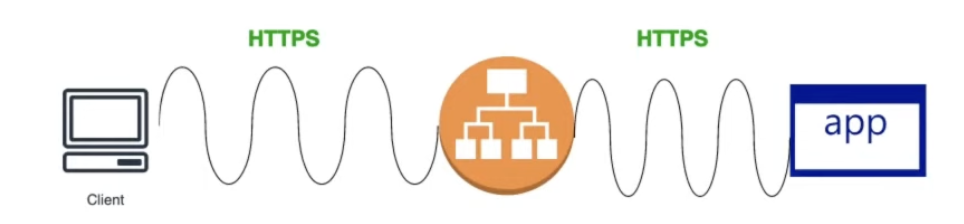
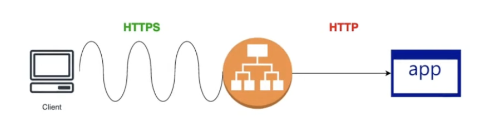
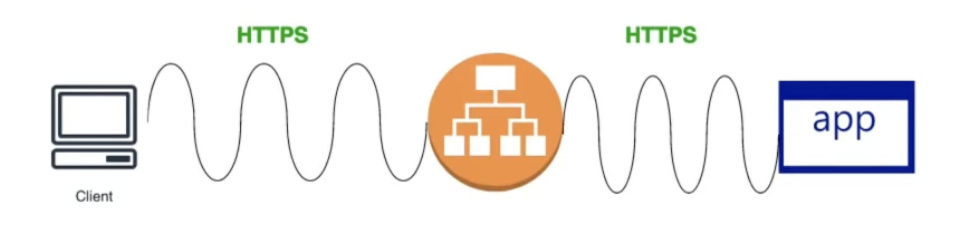
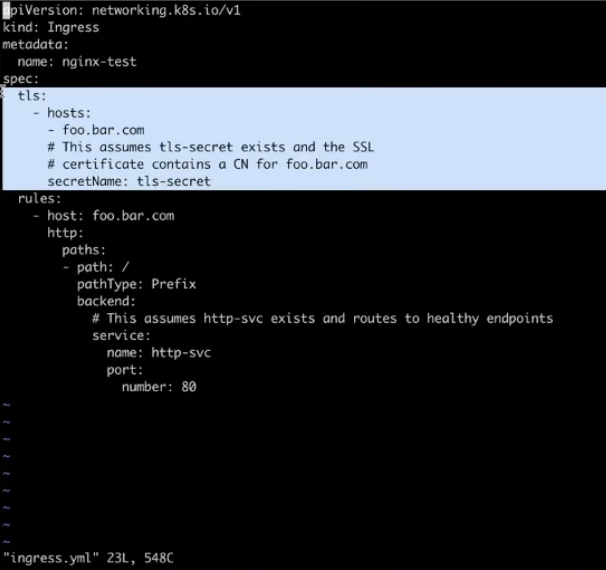

### TLS Termination and Security Models

Securing traffic via TLS is a primary function of Ingress. Organizations must choose a termination strategy based on their specific security and performance requirements.

**1\. SSL Passthrough**

The request remains encrypted from the client all the way to the server (pod). The load balancer does not decrypt the packet.

- **Pros:** Highly secure; the load balancer never sees the raw data.
- **Cons:** The load balancer cannot perform Layer 7 functions (WAF, path-based routing, session cookies) because it cannot read the packet. It also increases latency, as each individual pod must handle the heavy lifting of decryption.
- **Risk:** Malicious packets cannot be inspected at the edge, allowing potential threats to reach the server directly.

**2\. SSL Offloading (Edge Termination)**

The load balancer decrypts the traffic and sends plain HTTP to the internal service.

- **Pros:** Reduces the processing load on internal services, lowering application latency.
- **Cons:** Highly discouraged for sensitive environments. Because traffic is unencrypted between the load balancer and the service, the system is vulnerable to man-in-the-middle attacks.

**3\. SSL Bridging (Re-encryption)**

The load balancer decrypts the incoming packet for inspection and routing, then re-encrypts it before sending it to the service.

- **Pros:** Combines security and functionality. It allows the load balancer to perform WAF duties and routing while ensuring the "last mile" of traffic remains secure.
- **Cons:** High resource consumption, as decryption/encryption occurs at both the load balancer and the service levels.

## Example: Ingress with TLS:

You can run below command for accessing the application using TLS certificates

