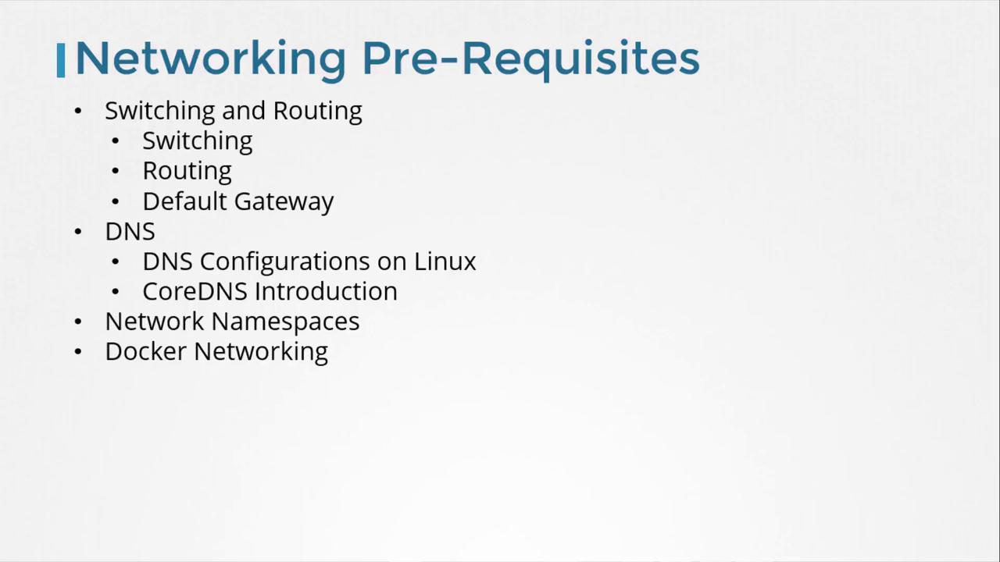
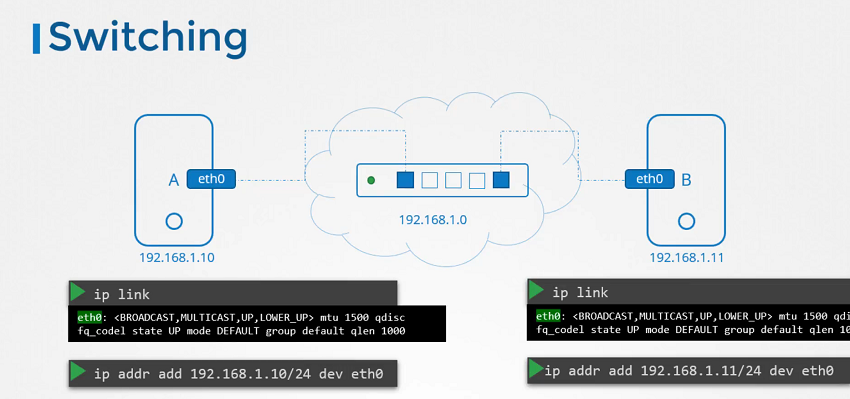
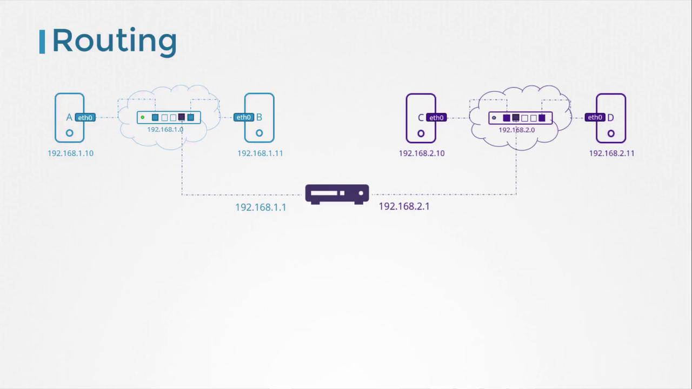
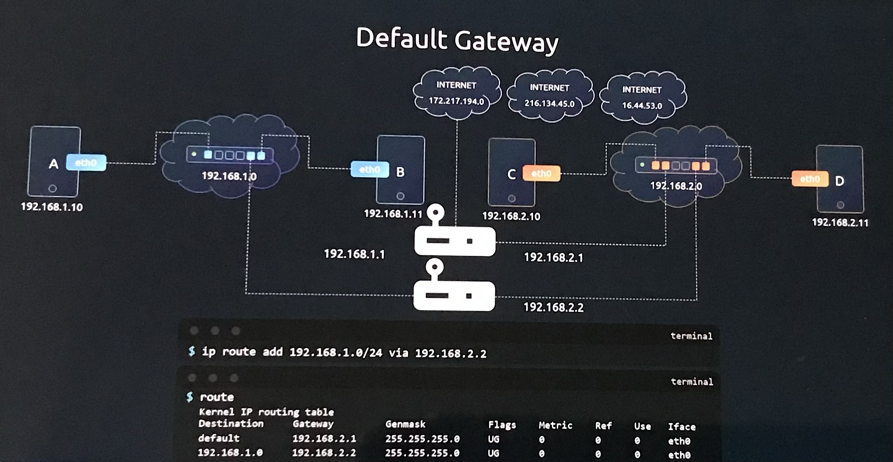
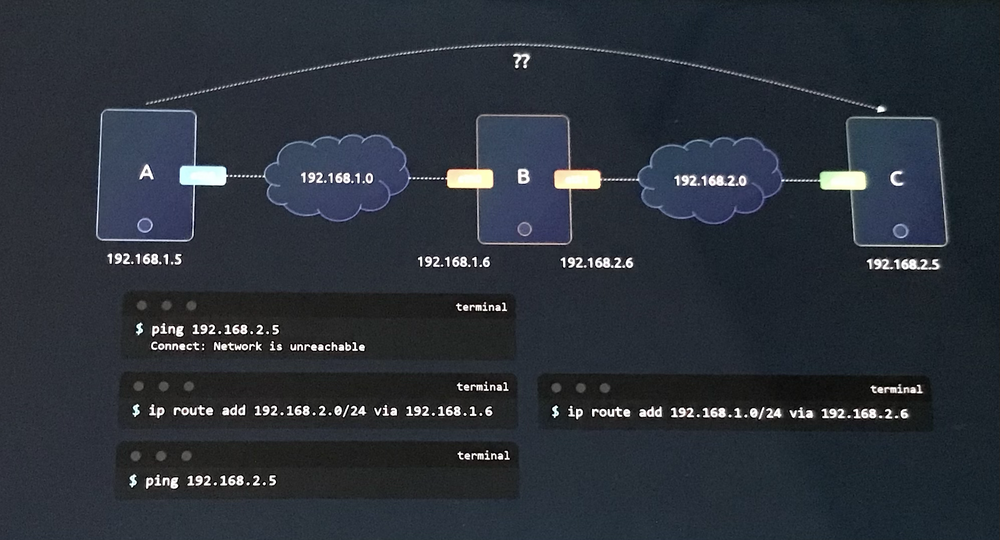

# Prerequisite Switching Routing Gateways CNI in kubernetes

> 💡 In this article, we explore essential networking concepts from a Linux perspective that are fundamental for configuring Kubernetes environments. We will cover topics such as switching, routing, gateways, DNS, network namespaces, and Docker networking. This guide targets both system administrators and application developers. If you are already confident with Linux networking, feel free to jump ahead to the Kubernetes-focused sections.



## Basic Networking Concepts

### Network Interfaces and Switching



Consider two systems—labeled A and B—that could be laptops, desktops, or virtual machines. To enable communication between them, each system must be connected to a switch with its respective network interface (either physical or virtual).Switch creates a network containing the two systems. To list available interfaces on a Linux host, execute:

```bash theme={null}
ip link
```

A sample output might be:

```bash theme={null}
eth0: <BROADCAST,MULTICAST,UP,LOWER_UP> mtu 1500 qdisc fq_codel state UP mode DEFAULT group default qlen 1000
```

Assuming these systems belong to the network 192.168.1.0, you can assign IP addresses using the following command:

- For System A

```bash theme={null}
ip addr add 192.168.1.10/24 dev eth0
```

- For System B

```bash theme={null}
ip addr add 192.168.1.11/24 dev eth0
```

After configuration, test connectivity by pinging another host within the same network:

```bash theme={null}
ping 192.168.1.11
```

A successful ping might look like:

```bash theme={null}
Reply from 192.168.1.11: bytes=32 time=4ms TTL=117
```

> Note: A Switch can only enable communication within a network

### Routing Between Subnets

Now, consider a second network, such as 192.168.2.0, with hosts assigned IPs like 192.168.2.10 and 192.168.2.11. For communication between these two networks, a router is necessary.

A router interconnects two or more networks and holds an IP address in each network—e.g., 192.168.1.1 for the first network and 192.168.2.1 for the second. When a system on network 192.168.1.0 (say, with IP 192.168.1.11) needs to communicate with a system on network 192.168.2.0, it forwards packets to the router.



Each system must be configured with a gateway or specific route entries to ensure that packets reach the intended destination. To view the current routing table, use:

```bash theme={null}
route
```

Initially, communication will be limited to the same subnet. To route traffic destined for 192.168.2.0 via the router (with IP 192.168.1.1), add the following route:

```bash theme={null}
ip route add 192.168.2.0/24 via 192.168.1.1
```

After adding the route, verifying the routing table should show an entry similar to:

```bash theme={null}
route
Kernel IP routing table
Destination     Gateway         Genmask         Flags Metric Ref    Use Iface
192.168.2.0     192.168.1.1     255.255.255.0   UG    0      0        0 eth0
```

If a return route is required (for instance, for a host in network 192.168.2.0 to reach a host in 192.168.1.0), add the appropriate route on that system using its corresponding gateway (e.g., 192.168.2.1).

```bash theme={null}
ip route add 192.168.1.0/24 via 192.168.2.1
```

After adding the route, verifying the routing table should show an entry similar to:

```bash theme={null}
route
Kernel IP routing table
Destination     Gateway         Genmask         Flags Metric Ref    Use Iface
192.168.1.0     192.168.2.1     255.255.255.0   UG    0      0        0 eth0
```

### Configuring Default Routes for Internet Access

If Systems need access to the internet(access to google at 172.27.194.0 network on the internet). Connect the router to the internet and then add a new route in your routing tables to route all traffic to the network 172.27.194.0 through your router.

```bash theme={null}
ip route add 172.27.194.0 via 192.168.2.1
```

To enable internet access to any external network (such as reaching external hosts like 172.217.194.0), configure the router as the default gateway. This is done by adding a default route:

```bash theme={null}
ip route add default via 192.168.2.1
```

Afterward, your routing table might resemble the following:

```bash theme={null}
route
Kernel IP routing table
Destination     Gateway         Genmask         Flags Metric Ref    Use Iface
192.168.1.0     192.168.2.1     255.255.255.0   UG    0      0        0 eth0
172.217.194.0   192.168.2.1     255.255.255.0   UG    0      0        0 eth0
default         192.168.2.1     0.0.0.0         UG    0      0        0 eth0
```

> 💡 The "default" or "0.0.0.0" entry indicates that any destination not explicitly listed in the routing table will be directed through the specified gateway.

For scenarios involving multiple routers—such as one handling internet traffic and another managing internal networks—ensure each network has its specific routing entry along with a default route for all other traffic.



For example, to route traffic to network 192.168.1.0 via an alternative gateway (192.168.2.2), use:

```bash theme={null}
ip route add 192.168.1.0/24 via 192.168.2.2
```

The updated routing table should include:

```bash theme={null}
route
Kernel IP routing table
Destination     Gateway         Genmask         Flags Metric Ref    Use Iface
default         192.168.2.1     0.0.0.0         UG    0      0        0 eth0
192.168.1.0     192.168.2.2     255.255.255.0   UG    0      0        0 eth0
```

If you encounter internet connectivity issues, reviewing the routing table and default gateway configuration is a good troubleshooting practice.

## Configuring a Linux Host as a Router



Consider a scenario with three hosts (A, B, and C) where hostA and hostB connects to 192.168.1.0; hostB and hostC are connected to a network 192.168.2.0 ; host B connects to both subnets (192.168.1.x and 192.168.2.x) using two interfaces(etho and eth1). For example:

- **Host A:** 192.168.1.5
- **Host B:** 192.168.1.6 and 192.168.2.6 [have IP's at both networks]
- **Host C:** 192.168.2.5

For host A to communicate with host C, host A must direct traffic aimed at network 192.168.2.0 to host B. On host A, execute:

```bash theme={null}
ip route add 192.168.2.0/24 via 192.168.1.6
```

Similarly, host C needs a route for the 192.168.1.0 network via host B (using 192.168.2.6 as the gateway):

```bash theme={null}
ip route add 192.168.1.0/24 via 192.168.2.6
```

Once these routes are established, the "network unreachable" error should no longer occur when pinging between host A and host C.

### Enabling IP Forwarding on Linux

Even with the correct routing table, Linux does not forward packets between interfaces by default, as a security measure. For Example, Packets received on eth0 on hostB are not forwarded to elsewhere through eth1 . This setting is controlled by the IP forwarding parameter in `/proc/sys/net/ipv4/ip_forward`.

To check the IP forwarding status, run:

```bash theme={null}
cat /proc/sys/net/ipv4/ip_forward
```

A return value of `0` indicates that packet forwarding is disabled. To enable forwarding temporarily, run:

```bash theme={null}
echo 1 > /proc/sys/net/ipv4/ip_forward
```

Verifying again should now show:

```bash theme={null}
cat /proc/sys/net/ipv4/ip_forward
```

with the output:

```bash theme={null}
1
```

To ensure this setting persists across reboots, modify `/etc/sysctl.conf` and add or update the following line:

```text theme={null}
net.ipv4.ip_forward = 1
```

> 💡 Modifying `/etc/sysctl.conf` ensures that IP forwarding remains enabled even after a system restart.

## Summary of Key Commands

Below is a summary table of essential commands covered in this article:

| Operation                                                                      | Command Example                               |
| ------------------------------------------------------------------------------ | --------------------------------------------- |
| List network interfaces                                                        | `ip link`                                     |
| View assigned IP addresses                                                     | `ip addr`                                     |
| Assign an IP address                                                           | `ip addr add 192.168.1.10/24 dev eth0`        |
| View the routing table                                                         | `route`                                       |
| Add a specific route                                                           | `ip route add 192.168.1.0/24 via 192.168.2.1` |
| Set a default gateway                                                          | `ip route add default via 192.168.2.1`        |
| If the host is configured as a router. Check IP forwarding status on your host | `cat /proc/sys/net/ipv4/ip_forward`           |
| Enable IP forwarding temporarily                                               | `echo 1 > /proc/sys/net/ipv4/ip_forward`      |

Remember, changes made with these commands are temporary and will be reset upon reboot unless they are saved in the appropriate configuration files.

---

That concludes this article. In the next installment, we will dive into DNS configurations and further enhance your understanding of Kubernetes networking.

For additional details and further reading, refer to resources like [Kubernetes Documentation](https://kubernetes.io/docs/) and [Docker Hub](https://hub.docker.com/).
