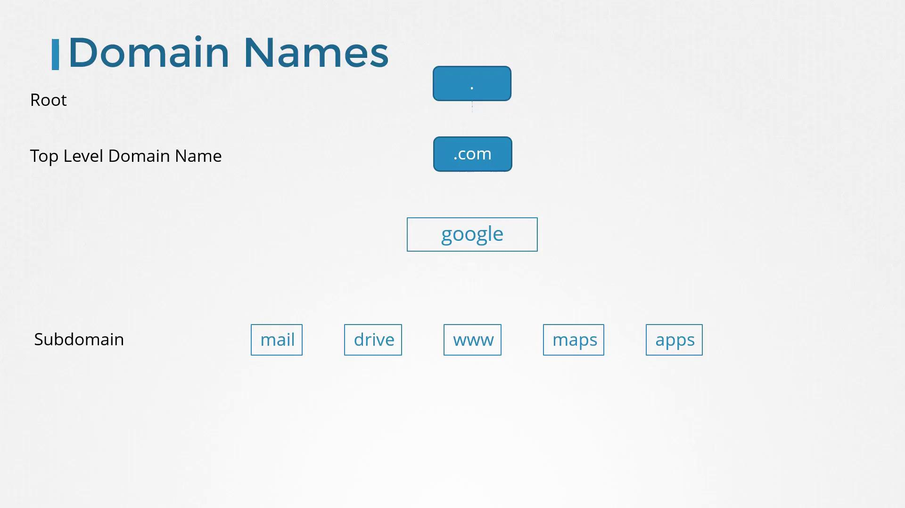
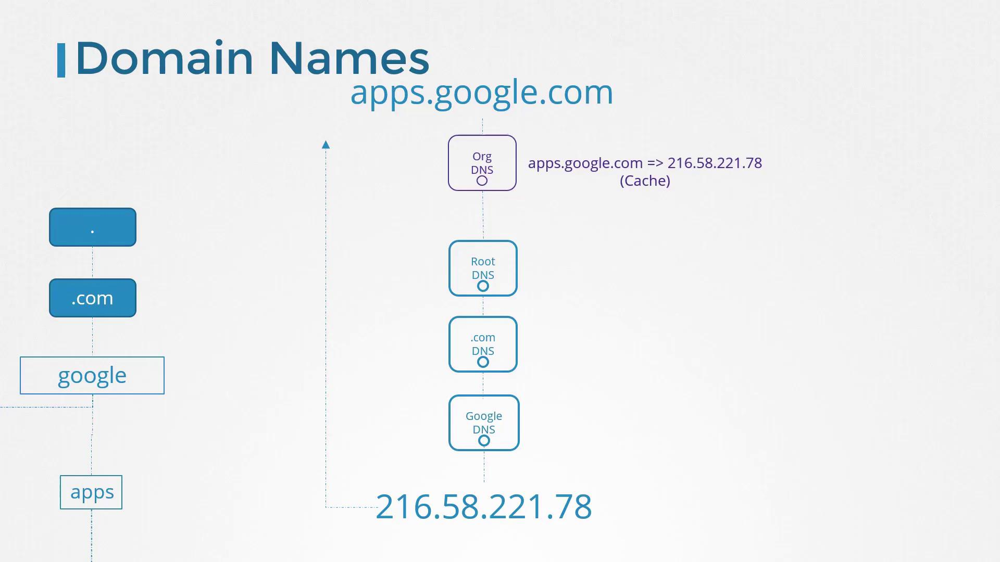
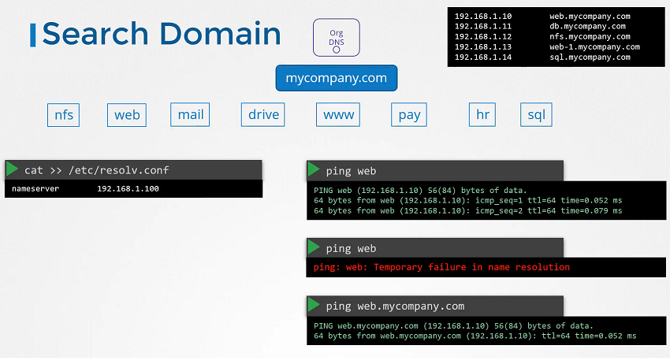

# DNS Basics

> 💡 Learn how local name resolution works and how to transition from simple `/etc/hosts` setups to a full-blown centralized DNS server.

## Understanding Local Name Resolution

Imagine you have two computers on the same network—Computer A with IP address 192.168.1.10 and Computer B with IP address 192.168.1.11. You can easily ping Computer B from Computer A using its IP address:

```bash theme={null}
ping 192.168.1.11
Reply from 192.168.1.11: bytes=32 time=4ms TTL=117
Reply from 192.168.1.11: bytes=32 time=4ms TTL=117
```

Suppose Computer B offers database services. Instead of remembering its IP address, you'll refer to it by a name, for example "db". However, if you immediately try to ping "db" from Computer A, the name remains unrecognized:

```bash theme={null}
ping db
ping: unknown host db
```

To make "db" recognizable, add an entry in the `/etc/hosts` file on Computer A. This informs the system that Computer B (192.168.1.11) is known as "db":

```bash theme={null}
cat >> /etc/hosts
192.168.1.11    db
```

After this change, pings to "db" resolve correctly:

```bash theme={null}
ping db
PING db (192.168.1.11) 56(84) bytes of data.
64 bytes from db (192.168.1.11): icmp_seq=1 ttl=64 time=0.052 ms
64 bytes from db (192.168.1.11): icmp_seq=2 ttl=64 time=0.079 ms
```

> 💡 Once you trust the mappings in `/etc/hosts`, the system does not verify whether the actual hostname (e.g., Computer B's real name) matches the alias you defined.

You can even create multiple aliases for a single IP address. For instance, you might convince Computer A that Computer B is also known as "[www.google.com](http://www.google.com)":

```bash theme={null}
cat >> /etc/hosts
192.168.1.11    db
192.168.1.11    www.google.com

ping db
PING db (192.168.1.11) 56(84) bytes of data.
64 bytes from db (192.168.1.11): icmp_seq=1 ttl=64 time=0.052 ms
64 bytes from db (192.168.1.11): icmp_seq=2 ttl=64 time=0.079 ms

ping www.google.com
PING www.google.com (192.168.1.11) 56(84) bytes of data.
64 bytes from www.google.com (192.168.1.11): icmp_seq=1 ttl=64 time=0.052 ms
64 bytes from www.google.com (192.168.1.11): icmp_seq=2 ttl=64 time=0.079 ms
```

Every time you reference a host by name—whether by ping, SSH, or curl—the system consults the `/etc/hosts` file for IP address mapping. This process is called name resolution:

```bash theme={null}
cat >> /etc/hosts
192.168.1.11    db
192.168.1.11    www.google.com

ping db
ssh db
curl http://www.google.com
```

> 💡 While managing local `/etc/hosts` files works for small networks, it becomes difficult to maintain as the number of systems grows and IP addresses change.

## Scaling with a Centralized DNS Server

To overcome the challenges of managing numerous local host mappings, organizations consolidate all mappings on a centralized DNS server. Suppose your centralized DNS server is at IP address 192.168.1.100. You configure each host to use this server by editing the `/etc/resolv.conf` file:

```bash theme={null}
cat /etc/resolv.conf
nameserver 192.168.1.100
```

Once configured, any hostname that is not found in `/etc/hosts` is resolved via the DNS server. If an IP address changes, you update the DNS server's records instead of modifying each system individually. Although local `/etc/hosts` entries—which are useful for test servers—are still honored, they take precedence over DNS queries. The resolution order is defined in `/etc/nsswitch.conf`:

```bash theme={null}
cat /etc/nsswitch.conf
...
hosts:          files dns
...
```

> 💡 Note: "files" refer to `/etc/hosts` file and "dns" refers to DNS server

In this configuration, the system first searches the `/etc/hosts` file for a hostname. If a match is not found, it then queries the DNS server. This order can be modified by editing this entry in the file

Now, if you try pinging a hostname not found in either `/etc/hosts` or the DNS server (e.g., [www.facebook.com](http://www.facebook.com)), the resolution fails:

```bash theme={null}
cat >> /etc/hosts
192.168.1.115 test

cat /etc/nsswitch.conf
...
hosts:          files dns
...

ping www.facebook.com
ping: www.facebook.com: Temporary failure in name resolution
```

To resolve external domains like Facebook, add a public DNS server (for example, Google's 8.8.8.8) or configure your internal DNS server to forward unresolved queries to a public DNS resolver.

## Domain Names and Structure

Up until now, we have been resolving internal hostnames such as web, db, and nfs. But what is a domain name? A domain name (like [www.facebook.com](http://www.facebook.com)) is composed of parts separated by dots:

• The top-level domain (TLD) appears at the end (e.g., .com, .net, .edu, .org).\
• The domain name precedes the TLD (e.g., facebook in [www.facebook.com](http://www.facebook.com)).\
• Any segment before the domain name is considered a subdomain (e.g., www).

For instance, consider Google's domain:
• The root is implicit.\
• ".com" is the TLD.\
• "google" is the main domain.\
• "www" is a subdomain.

Subdomains allow organizations to separate services. Examples from Google include [maps.google.com](https://maps.google.com) for maps, [drive.google.com](https://drive.google.com) for storage, and [mail.google.com](https://mail.google.com) for email.


When your organization attempts to access a domain like apps.google.com, the Organisation's DNS server first tries to resolve the name. Failing that, it forwards the request through a hierarchical process: a root DNS server directs it to a .com DNS server, which then points to Google's DNS server. The IP address is returned and cached temporarily to expedite future queries.



Similarly, organizations like mycompany.com can structure their domain by using subdomains for different services:

- [www.mycompany.com](http://www.mycompany.com): External website
- mail.mycompany.com: Email service
- drive.mycompany.com: Storage solution
- payroll.mycompany.com: Payroll systems
- hr.mycompany.com: Human resources

## Using Search Domains for Short Names



Within many organizations, it is often convenient to use short hostnames. To resolve a short name (for example, "web") to its fully qualified domain name (FQDN, such as web.mycompany.com), add a search domain to your `/etc/resolv.conf` file:

```bash theme={null}
cat >> /etc/resolv.conf
nameserver 192.168.1.100
search mycompany.com

ping web
PING web (192.168.1.10) 56(84) bytes of data.
64 bytes from web (192.168.1.10): icmp_seq=1 ttl=64 time=0.052 ms
64 bytes from web (192.168.1.10): icmp_seq=2 ttl=64 time=0.079 ms
```

Without the proper search domain, attempts to resolve "web" may fail:

```bash theme={null}
ping web
ping: web: Temporary failure in name resolution

ping web.mycompany.com
PING web.mycompany.com (192.168.1.10) 56(84) bytes of data.
64 bytes from web.mycompany.com (192.168.1.10): ttl=64 time=0.052 ms
```

You can also specify multiple search domains. In the following example, the system will sequentially append each provided domain until a match is found:

```bash theme={null}
cat >> /etc/resolv.conf
nameserver 192.168.1.100
search mycompany.com prod.mycompany.com

ping web
PING web.mycompany.com (192.168.1.10) 56(84) bytes of data.
64 bytes from web.mycompany.com (192.168.1.10): icmp_seq=1 ttl=64 time=0.052 ms
64 bytes from web.mycompany.com (192.168.1.10): icmp_seq=2 ttl=64 time=0.079 ms

ping web.mycompany.com
PING web.mycompany.com (192.168.1.10) 56(84) bytes of data.
64 bytes from web.mycompany.com (192.168.1.10): ttl=64 time=0.052 ms

ping web.mvcompany.com
ping: web: Temporary failure in name resolution
```

## Overview of Common DNS Record Types

DNS records map hostnames to IP addresses and serve various other purposes. Here is an overview of some common DNS record types:

| Record Type | Hostname        | Address/Mapping                                                                         |
| ----------- | --------------- | --------------------------------------------------------------------------------------- |
| A           | web-server      | Maps hostname to an IPv4 address (e.g., 192.168.1.1)                                    |
| AAAA        | web-server      | Maps hostname to an IPv6 address (e.g., 2001:0db8:85a3:0000:0000:8a2e:0370:7334)        |
| CNAME       | food.web-server | Aliases one hostname to another (e.g., aliasing to eat.web-server or hungry.web-server) |

A records handle IPv4 addresses, AAAA records are for IPv6, and CNAME records allow hostname aliasing.

## Testing DNS Resolution Tools

While ping is the most common tool for verifying basic DNS resolution, utilities like `nslookup` and `dig` provide more detailed insights.

> 💡 • The `nslookup` command does not consider `/etc/hosts` entries and only queries the configured DNS server.\
>  • The `dig` command offers comprehensive details about DNS queries.

### Example: nslookup

```plaintext theme={null}
> nslookup www.google.com
Server:		8.8.8.8
Address:	8.8.8.8#53

Non-authoritative answer:
Name:   www.google.com
Address: 172.217.0.132
```

### Example: dig

```bash theme={null}
dig www.google.com
; <<>> DiG 9.10.3-P4-Ubuntu <<>> www.google.com
;; global options: +cmd
;; Got answer:
;; ->>HEADER<<- opcode: QUERY, status: NOERROR, id: 28065
;; flags: qr rd ra; QUERY: 1, ANSWER: 6, AUTHORITY: 0, ADDITIONAL: 1

;; OPT PSEUDOSECTION:
; EDNS: version: 0, flags:; udp: 512
;; QUESTION SECTION:
;www.google.com.            IN      A

;; ANSWER SECTION:
www.google.com.     245     IN      A       64.233.177.103
www.google.com.     245     IN      A       64.233.177.105
www.google.com.     245     IN      A       64.233.177.147
www.google.com.     245     IN      A       64.233.177.106
www.google.com.     245     IN      A       64.233.177.104
www.google.com.     245     IN      A       64.233.177.99

;; Query time: 5 msec
;; SERVER: 8.8.8.8#53(8.8.8.8)
;; WHEN: Sun Mar 24 04:34:33 UTC 2019
;; MSG SIZE  rcvd: 139
```

# How to set up an actual DNS server using CoreDNS as the DNS solution.

Till now, we saw why you need a DNS server, how it can help manage name resolution in large environments with many hostnames and Ips, and how you can configure your hosts to point to a DNS server. Now, we will see how to configure a host as a DNS server.

We are given a server dedicated as the DNS server and a set of IPs to configure as entries in the server. There are many DNS server solutions out there; in this demo, we will focus on a particular one – CoreDNS.

So, how do you get core DNS? CoreDNS binaries can be downloaded from their Github releases page or as a docker image. Let’s go the traditional route. Download the binary using curl or wget. And extract it. You get the coredns executable

```bash theme={null}
$ curl -LO https://github.com/coredns/coredns/releases/download/v1.12.4/coredns_1.12.4_linux_amd64.tgz
$ tar -zxf coredns_1.12.4_linux_amd64.tgz
```

Run the executable to start a DNS server. It, by default, listens on port 53, which is the default port for a DNS server.

Now, we haven’t specified the IP to hostname mappings. For that, you need to provide some configurations. There are multiple ways to do that. We will look at one.

First, we put all of the entries into the DNS servers /etc/hosts file. Then, we configure CoreDNS to use that file. CoreDNS loads its configuration from a file named Corefile.

Here is a simple configuration that instructs CoreDNS to fetch the IP to hostname mappings from the file /etc/hosts. When the DNS server is run, it now picks the IPs and names from the /etc/hosts file on the server.

```bash theme={null}
.:53 { # Use /etc/hosts to resolve hostname
hosts /etc/hosts {
reload 1m
fallthrough
}

    # Forward unmatched queries to the host's resolver
    forward . /etc/resolv.conf {
       max_concurrent 1000
    }
    cache 30
    log
    errors

}

```

CoreDNS also supports other ways of configuring DNS entries through plugins. We will look at the plugin that it uses for Kubernetes in a later section.

Read more about CoreDNS here:

https://github.com/kubernetes/dns/blob/master/docs/specification.md

https://coredns.io/plugins/kubernetes/
