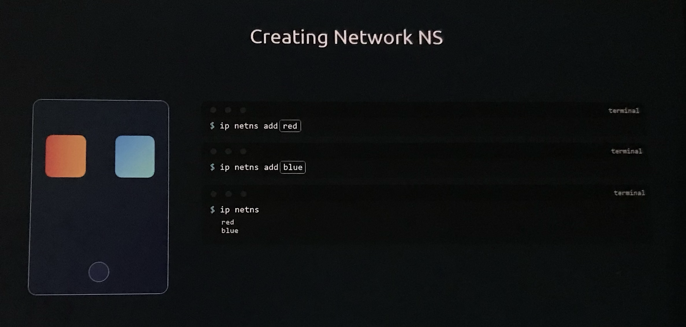
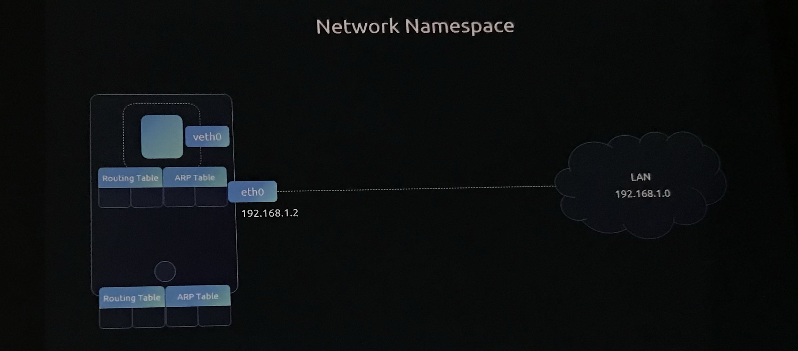
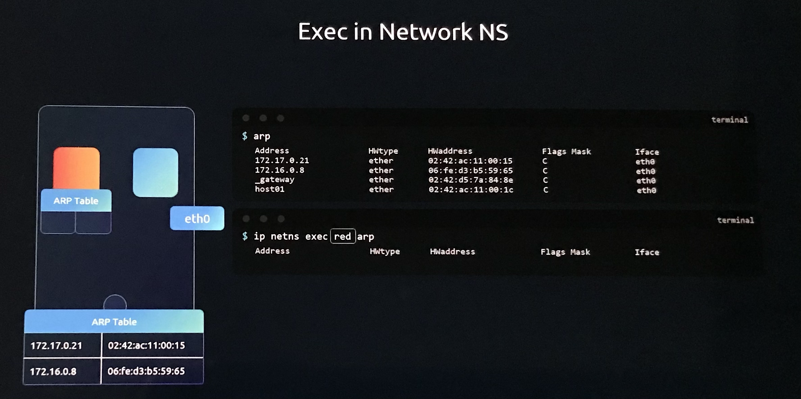
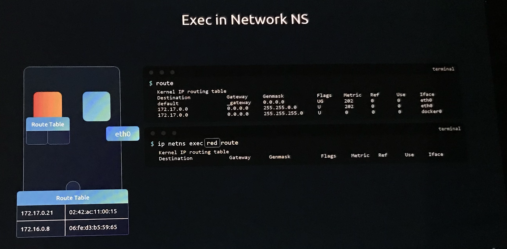
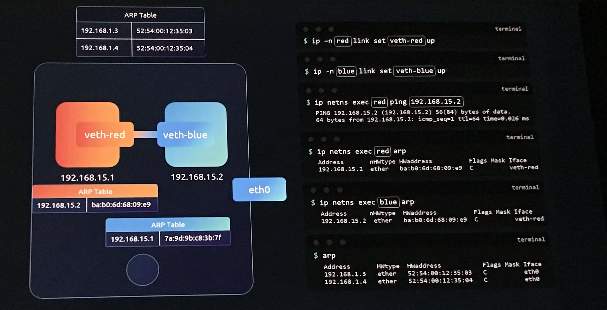
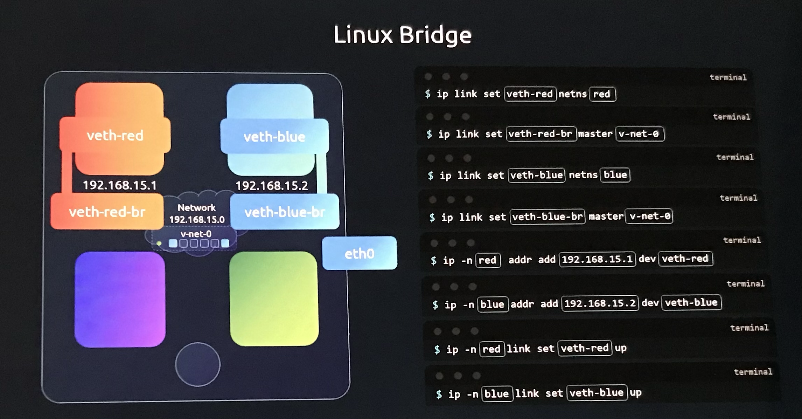
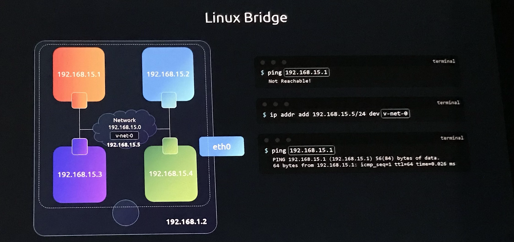
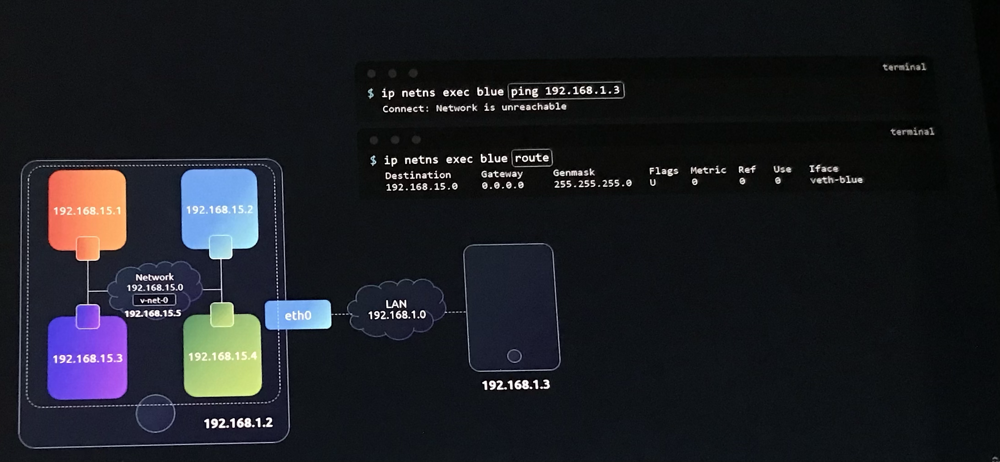
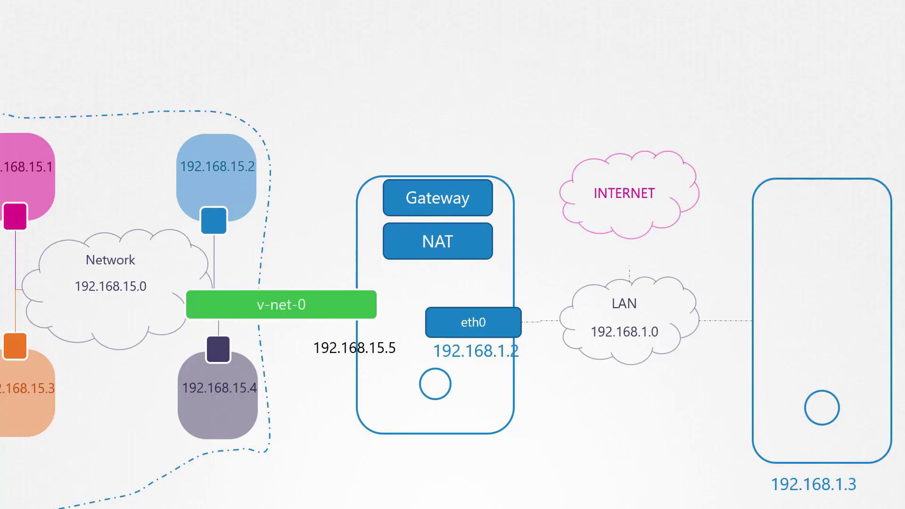

# Network Namespaces

> 💡 This article provides a comprehensive guide on network namespaces in Linux, focusing on network isolation and connectivity in containerized environments.

## Fundamentals of Namespaces and Isolation

Namespaces function as the primary mechanism for separating a container from its underlying host. This separation ensures that a container operates as if it were on its own dedicated host, unaware of other processes or network configurations.

### 1.1 **The "House" Analogy**

To understand namespaces, consider a host as a house and namespaces as individual rooms assigned to children.

- **Privacy**: Children (containers) only see what is inside their room and are unaware of activities in other rooms.
- **Visibility**: The parent (the host) retains full visibility into all rooms and the entire house.
- **Connectivity**: The parent can establish connections between rooms if desired.

### 1.2 Process Isolation

Isolation is verifiable through process IDs (PIDs). A process running inside a container may appear as PID 1. However, when viewed from the host as a root user, that same process is visible but carries a different PID. This demonstrates that while the host sees all processes, the namespace restricts the container’s view to its own specific environment.

```plaintext theme={null}
ps aux
USER     PID %CPU %MEM    VSZ   RSS TTY      STAT START   TIME COMMAND
root       1  0.0  0.0   4528   828 ?        Ss   03:06   0:00 nginx
```

However, listing processes on the host as root shows all processes running on the system—including those inside containers:

```plaintext theme={null}
ps aux
```

```plaintext theme={null}
(On the container)
USER       PID  %CPU %MEM    VSZ   RSS TTY      STAT START   TIME COMMAND
root         1  0.0  0.0   4528   828 ?        Ss   03:06   0:00 nginx

(On the host)
USER       PID  %CPU %MEM    VSZ   RSS TTY      STAT START   TIME COMMAND
project   3720  0.1  0.1   95500  4916 ?        R    06:06   0:00 sshd: project@pts/0
project   3725  0.0  0.1   95196  4132 ?        S    06:06   0:00 sshd: project@notty
project   3727  0.2  0.1   21352  5340 pts/0    S    06:06   0:00 -bash
root      3802  0.0  0.0   8924  3616 ?        S    06:06   0:00 docker-containerd-shim -namespace m
root      3816  1.0  0.0   4528   828 ?        Ss   06:06   0:00 nginx
```

## Network Isolation

On the networking front, the host maintains its own interfaces, ARP tables, and routing configurations—all of which remain hidden from containers. When a container is created, a dedicated network namespace gives it its own virtual interfaces, routing table, and ARP cache.

### Management Commands

The `ip netns` command suite is the primary tool for managing network namespaces on a Linux host.

| **Action**                           | **Command**                                                  |
| ------------------------------------ | ------------------------------------------------------------ |
| **Create a Namespace**               | `ip netns add [namespace_name]`                              |
| **List Namespaces**                  | `ip netns`                                                   |
| **Execute Command Inside Namespace** | `ip netns exec [name] [command]` OR `ip -n [name] [command]` |



### Scope of Isolation

Within a new namespace, the following components in namespaces are entirely independent of the host:

- **Interfaces:** In namespace, Only a loopback interface is initially present; physical host interfaces (e.g., eth0) are invisible.
- **ARP Tables:** Initially empty, as the namespace has no neighbours.
- **Routing Tables:** Initially empty, providing no path to external networks.



For example, running the following command on your host:

```bash theme={null}
ip link
```

displays the host’s interfaces (such as the loopback and Ethernet interfaces). To examine interfaces within a specific network namespace (for example, the "red" namespace), use:

```bash theme={null}
ip netns exec red ip link
```

Or with the shorthand using the –n option:

```bash theme={null}
ip -n red link
```

Inside the namespace, you typically see only a loopback interface, ensuring that host-specific interfaces (e.g., `eth0`) remain hidden. This isolation applies similarly to ARP and routing tables.





## Connecting Network Namespaces

By default, a network namespace has no connectivity because it lacks defined interfaces or routes. To connect namespaces, you create virtual Ethernet (veth) pairs that act like cables between two entities.



For example, to connect two namespaces—named "red" and "blue"—

1. first create a veth pair:

```bash theme={null}
ip link add veth-red type veth peer name veth-blue
```

2. Then, assign each end to its respective namespace:

```bash theme={null}
ip link set veth-red netns red
ip link set veth-blue netns blue
```

3. Next, assign IP addresses to each namespace’s interface—for example, 192.168.15.1 for "red" and 192.168.15.2 for "blue"—and bring the interfaces up:

```bash theme={null}
ip -n red addr add 192.168.15.1/24 dev veth-red
ip -n blue addr add 192.168.15.2/24 dev veth-blue

ip -n red link set veth-red up
ip -n blue link set veth-blue up
```

4. Test connectivity by pinging from the red namespace to the blue namespace:

```bash theme={null}
ip netns exec red ping 192.168.15.2
```

Verify neighbour discovery using ARP from within the red namespace:

```bash theme={null}
ip netns exec red arp
```

Expected output:

```plaintext theme={null}
Address          HWtype  HWaddress           Flags Mask  Iface
192.168.15.2    ether   ba:b0:6d:68:09:e9   C               veth-red
```

Similarly, checking the ARP table in the blue namespace should display an entry for the red namespace. Note that these internal veth interfaces do not appear in the host’s ARP table.

## Creating a Virtual Switch for Multiple Namespaces

When working with more than two namespaces, linking every pair using veth pairs is impractical. To create a Network, you need switch. To create virtual network , you need virtual switch. Establish a virtual network switch (or bridge network) on the host to interconnect all namespaces. Linux offers tools such as the native Linux bridge or Open vSwitch.



In this example, a Linux bridge is created:

1. Create a new bridge interface (named `v-net-0`):

   ```bash theme={null}
   ip link add v-net-0 type bridge
   ```

   > 💡 Note: The Bridge as a Hybrid: To the host, a bridge (e.g., vnet0) appears as a standard network interface. To the namespaces, it functions as a switch.

2. Bring the bridge interface up:

   ```bash theme={null}
   ip link set v-net-0 up
   ```

Namespaces can now be connected to this bridge. Remove the earlier direct veth pair as it is no longer necessary:

```bash theme={null}
ip -n red link del veth-red
```

Next, create new veth pairs to link each namespace to the bridge. For example, create a pair with one end named `veth-red` (to be moved into the red namespace) and the other end named `veth-red-br` (to be attached to the bridge):

```bash theme={null}
ip link add veth-red type veth peer name veth-red-br
ip link add veth-blue type veth peer name veth-blue-br
```

Attach the veth interfaces to their corresponding namespaces and the bridge:

```bash theme={null}
ip link set veth-red netns red
ip link set veth-red-br master v-net-0

ip link set veth-blue netns blue
ip link set veth-blue-br master v-net-0
```

Assign IP addresses and activate the interfaces inside each namespace:

```bash theme={null}
ip -n red addr add 192.168.15.1/24 dev veth-red
ip -n blue addr add 192.168.15.2/24 dev veth-blue

ip -n red link set veth-red up
ip -n blue link set veth-blue up
```

Host is on one network and the namespaces are on another network.To allow the host to communicate with the namespaces, assign an IP from the same subnet to the bridge interface:



```bash theme={null}
ip addr add 192.168.15.5/24 dev v-net-0
```

You can now verify connectivity from the host, for example:

```bash theme={null}
ping 192.168.15.1
```

> 💡 Because the bridge is an interface on the host, assigning an IP address to the bridge itself (on the same subnet as the namespaces) allows the host to communicate directly with the namespaces.

All traffic within this network remains private to the host, ensuring that namespaces are not directly accessible from external networks.

## Enabling External Connectivity

### Reaching the Local Area Network (LAN)

Namespaces cannot naturally reach the LAN or external hosts (e.g., 192.168.1.3) because they lack a route to those networks.



- **The Gateway:** The host acts as the gateway because it has interfaces on both the private namespace network (192.168.15.0)[v-net-0] and the external LAN (192.168.1.0)[eth0].
- **Configuration:** A route must be added to the namespace's routing table identifying the host's bridge IP as the gateway for external traffic.



For instance, pinging an external host (192.168.1.3) from the blue namespace would initially result in a "Network is unreachable" error:

```bash theme={null}
ip netns exec blue ping 192.168.1.3
```

> 💡 The only door to the outside world is the ethernet port(eth0) on the host

Checking the routing table in the blue namespace using:

```bash theme={null}
ip netns exec blue route
```

might display:

```plaintext theme={null}
Destination     Gateway         Genmask         Flags Metric Ref    Use Iface
192.168.15.0    0.0.0.0         255.255.255.0   U     0      0        0 veth-blue
```

To enable external connectivity, add a route in the blue namespace that directs traffic destined for 192.168.1.0/24 via the host’s IP on the bridge (192.168.15.5):

```bash theme={null}
ip netns exec blue ip route add 192.168.1.0/24 via 192.168.15.5
```

After this route is added, the blue namespace can reach external networks. However, external networks will not recognize the private IP addresses. To address this, configure NAT on the host using iptables. This setup masquerades packets from the 192.168.15.0/24 network with the host's external IP, making the traffic routable on the LAN.

To provide namespaces with Internet access (such as pinging 8.8.8.8), add a default route in the namespace pointing to the host; the host must then perform NAT to forward the traffic correctly.

## Enabling Inbound Access

Thus far, namespaces are isolated on an internal network and are not directly accessible from external hosts. For instance, if the blue namespace runs a web application on port 80, external users cannot access it simply by targeting its private IP.

There are two common solutions:

1. Add a static route on the external router or host so that traffic for the 192.168.15.0/24 network is directed through the host’s LAN IP (e.g., 192.168.1.2).

2. Use port forwarding via iptables on the host to redirect traffic arriving at a specific port on the host (e.g., port 80) to the corresponding port in the namespace.

> 💡 The port forwarding method is often preferred, as it eliminates the need to reconfigure external routing.

# Summary

## Network Namespace

Network Namespace separates container from host. It has independent interfaces, ARP tables and Routing table.

## Establishing Connectivity

By default namespaces has no connectivity[no defined interfaces, routes]. Connectivity must be manually "wired" using **Virtual Ethernet (veth) pairs**.

### Point-to-Point Connection

1. Create `veth` pair that acts like a virtual patch cable.
2. You place one end in Namespace A and the other in Namespace B.
3. Then assign IP addresses to enable direct communication.

### The Virtual Switch (Bridge)

Linking every namespace with individual cables is inefficient. Instead, a **Linux Bridge** (`v-net-0`) is created on the host to act as a virtual switch.

1.  **Creation:** The bridge is initialized on the host.
2.  **Connection:** Each namespace is connected to the bridge via a `veth` pair.
3.  **Assign IP to Namespace:** Assign IP address to each namespace interface
4.  **Host Access to Namespace:** By giving the bridge itself a namespace subnet IP address , the host can communicate with all connected namespaces.

### External Access and Routing

Even with a bridge, namespaces are stuck in a private internal network. Reaching the outside world requires two steps:

- **Outgoing Traffic (SNAT):** To reach the Internet, the namespace must have a **Default Gateway** (the host’s bridge IP). The host then uses **NAT (Network Address Translation)** to mask the namespace's private IP with its own public/LAN IP.
- **Incoming Traffic (Port Forwarding):** External users cannot "see" private namespace IPs. To grant access (e.g., to a web server), the host uses `iptables` to map a specific host port (like 8080) to a namespace port (like 80).

This concludes our guide on network namespaces. By following these steps, you can effectively isolate, connect, and manage network namespaces for containerized environments. Thank you for reading!

# Summary Table

<table style="min-width: 75px;"><colgroup><col style="min-width: 25px;"><col style="min-width: 25px;"><col style="min-width: 25px;"></colgroup><tbody><tr><td colspan="1" rowspan="1"><p><strong>Category</strong></p></td><td colspan="1" rowspan="1"><p><strong>Key Concept</strong></p></td><td colspan="1" rowspan="1"><p><strong>Description</strong></p></td></tr><tr><td colspan="1" rowspan="1"><p><strong>Connectivity</strong></p></td><td colspan="1" rowspan="1"><p><strong>veth Pairs</strong></p></td><td colspan="1" rowspan="1"><p>Virtual cables used to connect two namespaces or a namespace to a virtual switch.Then assign IP addresses to enable direct communication.</p></td></tr><tr><td colspan="1" rowspan="1"><p><strong>Scaling</strong></p></td><td colspan="1" rowspan="1"><p><strong>Linux Bridge</strong></p></td><td colspan="1" rowspan="1"><p>A virtual switch (<code>v-net-0</code>) that allows multiple namespaces to communicate on a single private network.</p></td></tr><tr><td colspan="1" rowspan="1"><p><strong>Gateway</strong></p></td><td colspan="1" rowspan="1"><p><strong>The Host</strong></p></td><td colspan="1" rowspan="1"><p>The Host acts as the "door" to the outside world, routing traffic between private namespace IPs and the physical LAN.</p></td></tr><tr><td colspan="1" rowspan="1"><p><strong>Outbound</strong></p></td><td colspan="1" rowspan="1"><p><strong>NAT / Masquerading</strong></p></td><td colspan="1" rowspan="1"><p>Allows namespaces to reach the internet by replacing their private IP with the Host's IP via <code>iptables</code>.</p></td></tr><tr><td colspan="1" rowspan="1"><p><strong>Inbound</strong></p></td><td colspan="1" rowspan="1"><p><strong>Port Forwarding</strong></p></td><td colspan="1" rowspan="1"><p>Maps a Host port to a Namespace port so external users can access applications (e.g., a web server) inside the container.</p></td></tr></tbody></table>
