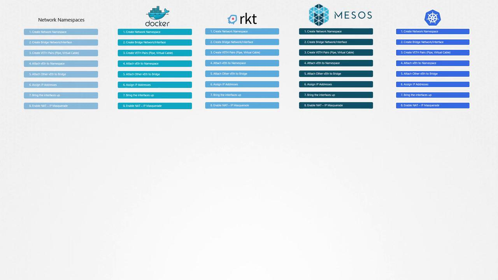
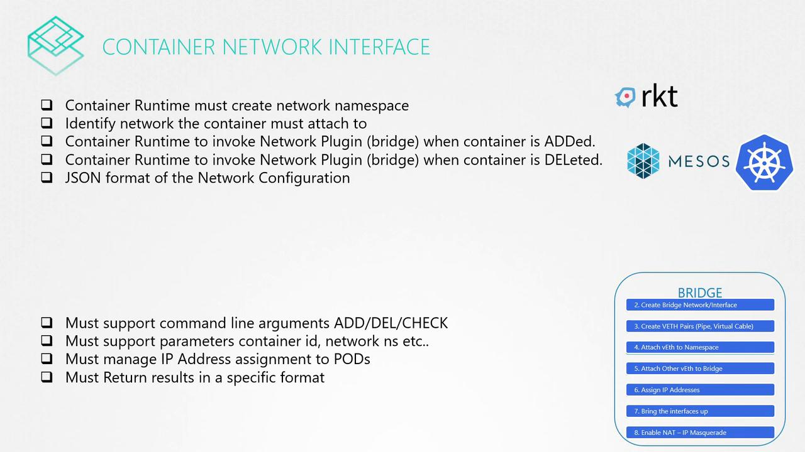

# Prerequisite CNI

> 💡 This article provides a comprehensive guide on the Container Networking Interface (CNI) and its role in simplifying container networking configuration and management.

We explore how network namespaces and standardized networking plugins simplify the configuration and management of container networks.

## Container networking configuration:

Network namespaces create isolated network environments on a single host. These namespaces are interconnected by a bridge network that establishes virtual interfaces (or virtual cables) for communication between namespaces. This involves assigning IP addresses, activating interfaces, and enabling NAT or IP masquerading for external connectivity. Although Docker configures its bridge networking using similar methods, it employs its own naming conventions. Other container platforms like Rocket, Mesos Containerizer, and Kubernetes address these networking challenges in a comparable way.



## Automating Connectivity with the Bridge Program

To standardize this process and avoid duplicating efforts across multiple platforms, a dedicated program known as "bridge" was developed. This program automates the tasks required to connect a container to a bridge network. For instance, you can run the program with the container ID and network namespace as shown below:

```bash theme={null}
bridge add 2e34dcf34 /var/run/netns/2e34dcf34
```

The "bridge" program handles low-level networking configuration, freeing container runtime environments from such complexities. When container platforms like Rocket or Kubernetes spin up a new container, they invoke this bridge program—passing the container ID and namespace—to automatically set up the network.

> 💡 By offloading network configuration tasks to a standardized bridge program, container runtimes can focus on higher-level operations while ensuring consistent and reliable network setups via CNI-compliant plugins.

This brings us to an important question: if you want to develop a similar program for a different networking scenario, which commands and arguments should it support? How do you ensure compatibility with container runtimes like Kubernetes or Rocket? The solution lies in establishing a set of standards—this is where the Container Networking Interface (CNI) comes into play.

## CNI Plugin Responsibilities and Workflow

> 💡 CNI defines a standard for creating and integrating network plugins with container runtime environments.

These plugins are responsible for:

- Creating a network namespace for each container.
- Identifying the networks to which the container should connect.
- Configuring the network when a container is created (using the "add" command) and cleaning up when it is deleted (using the "del" command).
- Setting up necessary network details via a JSON configuration file.

On the plugin side, CNI requires support for three command-line arguments: "add", "del", and "check". These commands must accept parameters such as the container ID and network namespace. The plugin then takes over to manage IP addresses and necessary routing, ensuring that containers can communicate effectively. The output of these operations must follow a strict format for consistency.



When both container runtimes and network plugins adhere to CNI standards, seamless interoperability is achieved. Any CNI-compliant plugin can work with any container runtime that supports these standards. The ecosystem already includes several CNI plugins such as bridge, VLAN, IP VLAN, MAC VLAN, and even one designed for Windows. IP address management (IPAM) plugins like host-local and DHCP are also available, along with third-party solutions like Weave, Flannel, Cilium, VMware NSX, Calico, and Infoblox.

## How Kubernetes handles networking with Docker?

> 💡 Docker uses its own networking standard known as the Container Network Model (CNM), which differs from CNI. To use CNI with Docker, you must create a container without network configuration (using the “none” option) and then manually invoke the CNI plugin to set up networking.

Consider the following example that demonstrates how Kubernetes handles networking with Docker:

```bash theme={null}
docker run --network=none nginx
bridge add 2e34dcf34 /var/run/netns/2e34dcf34
```

In this workflow, Kubernetes first creates a Docker container without any network configuration and then calls the CNI plugin to establish the network. This process highlights how Kubernetes efficiently leverages CNI standards to manage container networks.

---

For further information, explore these resources:

- [Kubernetes Basics](https://kubernetes.io/docs/concepts/overview/what-is-kubernetes/)
- [Kubernetes Documentation](https://kubernetes.io/docs/)
- [Docker Hub](https://hub.docker.com/)
- [Terraform Registry](https://registry.terraform.io/)

Dive deeper into container networking and harness the power of CNI standards in your deployments. Happy networking!
